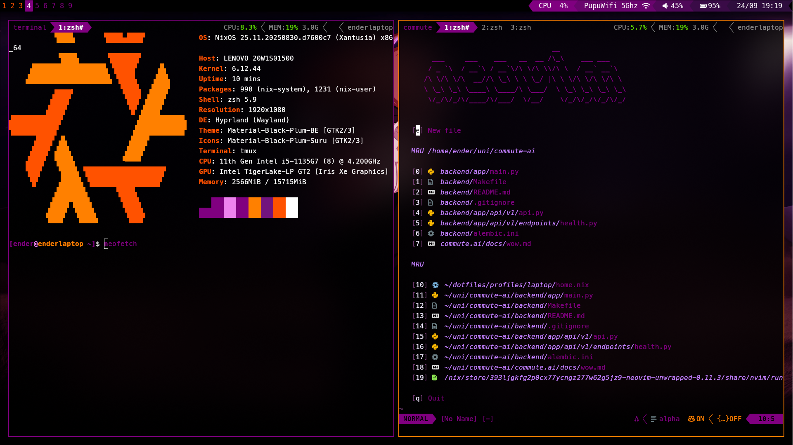

# my dotfiles

This repo is the home for my dotfiles. I manage them with Nix.

## what's here

- **WM**: hyprland + waybar
- **Editor**: neovim (nixvim config)  
- **Terminal**: kitty + tmux + zsh (oh-my-zsh)
- **Theme**: custom "pain" theme (purple/orange vibes)
- **File manager**: thunar or nautilus
- **Launcher**: rofi

## setup

```bash
# clone wherever
git clone https://github.com/3nd3r1/.dotfiles ~/dotfiles
cd ~/dotfiles

# laptop setup
./rebuild-laptop.sh

# work setup  
./rebuild-work.sh
```

## profiles

- `laptop` - personal laptop setup
- `work` - work machine with teams/evolution/etc

## theme

everything uses the "pain" colorscheme:
- purple (#800080) 
- orange (#ff8000)
- black backgrounds
- custom tmux/waybar/rofi themes


